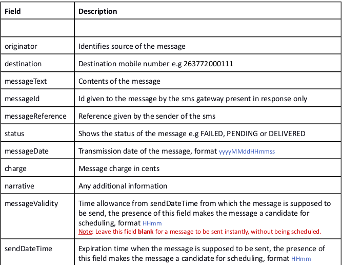

============
bmg_sms_gateway
============
.. image:: https://img.shields.io/pypi/v/country_list.svg
        :target: https://github.com/RONALD55/BMG-SMS-GATEWAY

.. image:: https://img.shields.io/badge/code%20style-black-000000.svg
        :target: https://github.com/RONALD55/BMG-SMS-GATEWAY

Features
--------

-  This is package can be used to integrate python programs or scripts with the BMG SMS gateway provided by :eSolutions:`http://www.esolutions.co.zw/`.

Installation
------------

To can install the zim_validate package open shell or terminal and run::

    pip install bmg_sms_gateway

Usage
-----
Send Single SMS :

To send a single message use the function below. It will return response code 200 if the message has been sent. The function accepts three parameters which are username,password and body. The body is a dictionary and it should contain all the keys and shown on the example below.

.. code-block:: python

    from bmg_sms_gateway import send_single_sms

    username = 'username'
    password = 'password'

    #Message body
    body = {
        "originator": "Originator",
        "destination": "Destination Mobile #",
        "messageText": "Message to be sent",
        "messageReference": "Your unique message identifier",
        "messageDate": "Message date",
        "messageValidity": "Message Validity",
        "sendDateTime": "Send Datetime"
    }
    print(send_single_message(username,password,body))

Description of fields
------

License
-------

The project is licensed under the MIT license.
